# WebCAD 项目流程图与模块说明

> 本文档描述 WebCAD 项目的整体架构、各模块功能及数据流转流程。
> WebCAD 是一个基于 C++11 编写、通过 Emscripten 编译为 WebAssembly（WASM）的跨平台 CAD（计算机辅助设计）内核。

---

## 目录

1. [项目概述](#1-项目概述)
2. [整体架构图](#2-整体架构图)
3. [模块详解](#3-模块详解)
   - [Kernel（核心）](#31-kernel核心)
   - [Ac（基础工具）](#32-ac基础工具)
   - [Ge（几何引擎）](#33-ge几何引擎)
   - [Rx（运行时/反射系统）](#34-rx运行时反射系统)
   - [Ev（事件系统）](#35-ev事件系统)
   - [Ap（应用/文档管理）](#36-ap应用文档管理)
   - [Db（数据库层）](#37-db数据库层)
   - [Gi（图形渲染）](#38-gi图形渲染)
   - [Gs（图形元素）](#39-gs图形元素)
   - [Re（渲染器管理）](#310-re渲染器管理)
   - [Ed（编辑器/命令）](#311-ed编辑器命令)
   - [Pr（解析器）](#312-pr解析器)
   - [Emscripten（JS绑定层）](#313-emscriptenjs绑定层)
4. [核心数据流程](#4-核心数据流程)
   - [系统初始化流程](#41-系统初始化流程)
   - [DXF文件加载流程](#42-dxf文件加载流程)
   - [渲染流程](#43-渲染流程)
   - [用户输入与命令执行流程](#44-用户输入与命令执行流程)
   - [对象序列化流程](#45-对象序列化流程)
5. [模块依赖关系](#5-模块依赖关系)
6. [技术栈](#6-技术栈)
7. [构建系统](#7-构建系统)
8. [目录结构](#8-目录结构)

---

## 1. 项目概述

WebCAD 是一个功能完整的 CAD 内核，设计目标是在 Web 浏览器中运行。它的整体架构参考了 AutoCAD 的内部模型（ObjectARX），提供了以下核心能力：

| 能力 | 说明 |
|------|------|
| 二维/三维几何运算 | 点、线、弧、NURBS 曲线/曲面的精确计算与变换 |
| 数据库驱动对象模型 | 类似 AutoCAD 的图层、块、线型、样式等符号表管理 |
| DXF 文件解析 | 读取标准 CAD DXF 格式文件 |
| 图形渲染准备 | 几何数据转换为可供 WebGL 渲染的顶点数据 |
| 命令系统 | 可扩展的 CAD 命令注册与执行框架 |
| 用户交互 | 鼠标、触控、键盘事件统一处理 |
| WebAssembly 导出 | 通过 Emscripten Embind 将 200+ 个 C++ 类暴露给 JavaScript |

---

## 2. 整体架构图

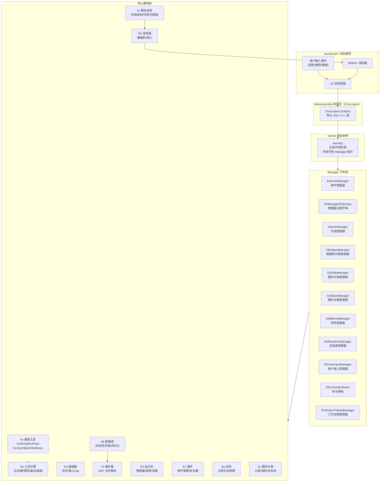

---

## 3. 模块详解

### 3.1 Kernel（核心）

**路径**: `kernel/src/kernel/kernel.cpp` | `kernel/Include/public/kernel.h`

Kernel 是整个系统的**单例中枢**，在程序启动时由 `acrxManagerDictionary()->instantiate()` 完成初始化。它持有所有子系统 Manager 的指针，是跨模块通信的唯一入口。

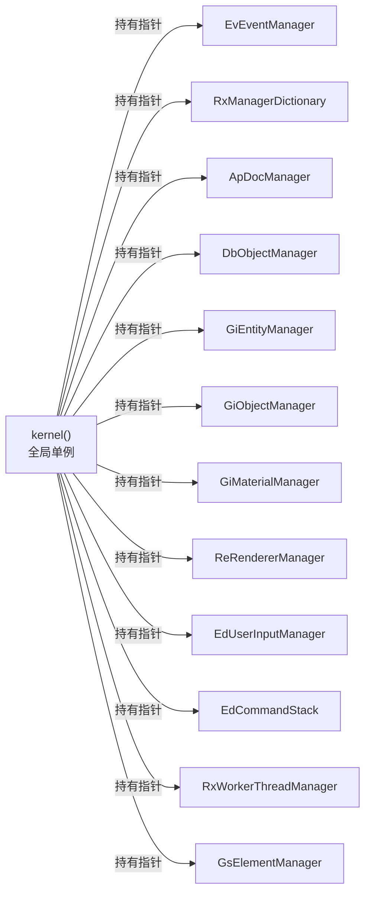

**主要接口**：

| 函数 | 返回类型 | 说明 |
|------|----------|------|
| `kernel()->acevEventManager()` | `EvEventManager*` | 事件管理器 |
| `kernel()->acdbObjectManager()` | `DbObjectManager*` | 数据库对象管理器 |
| `kernel()->acgiEntityManager()` | `GiEntityManager*` | 图形实体管理器 |
| `kernel()->acreRendererManager()` | `ReRendererManager*` | 渲染器管理器 |
| `kernel()->acedUserInputManager()` | `EdUserInputManager*` | 用户输入管理器 |

---

### 3.2 Ac（基础工具）

**路径**: `kernel/src/Ac/` | `kernel/Include/public/Ac/`

提供整个系统所需的**基础数据结构与工具类**，被所有其他模块依赖。

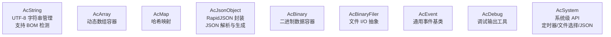

**核心功能**：
- `AcString`: 线程安全的字符串，支持 UTF-8、宽字符转换
- `AcJsonObject`: 对 RapidJSON 的轻量封装，用于配置和序列化
- `AcSystem::setInterval()`: 供 `main.cpp` 调用以驱动定时渲染
- `AcBinaryFiler`: 为 DWG 序列化提供文件读写抽象

---

### 3.3 Ge（几何引擎）

**路径**: `kernel/src/Ge/`（67个文件） | `kernel/Include/public/Ge/`

几何引擎是 CAD 核心中**最大的模块**，提供完整的二维/三维几何计算能力。

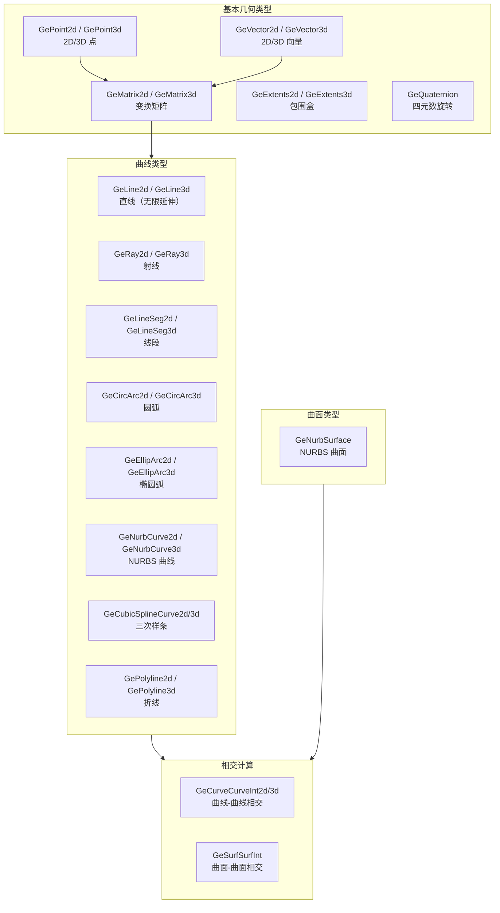

**模块职责**：
- 所有几何对象提供变换（`transformBy(GeMatrix3d)`）、最近点（`closestPointTo()`）等通用接口
- NURBS 曲线/曲面支持控制点、权重、节点向量的完整定义
- 交集计算返回参数化交点，支持多个相交结果
- 通过 `GeExport.cpp`（1440行）全量暴露给 JavaScript

---

### 3.4 Rx（运行时/反射系统）

**路径**: `kernel/src/Rx/`（18个文件） | `kernel/Include/public/Rx/`

提供系统级的**管理器注册、线程池和变量系统**。

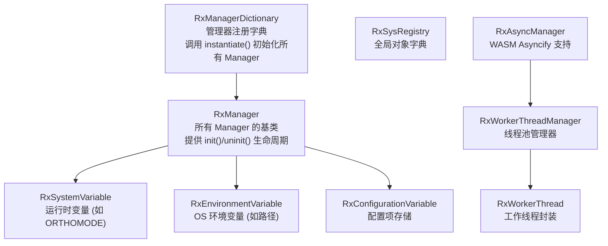

---

### 3.5 Ev（事件系统）

**路径**: `kernel/src/Ev/`（4个文件） | `kernel/Include/public/Ev/`

提供系统级的**事件分发机制**，连接定时器、数据库变更与上层应用。

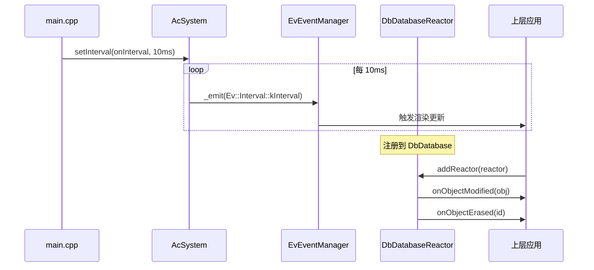

---

### 3.6 Ap（应用/文档管理）

**路径**: `kernel/src/Ap/`（7个文件） | `kernel/Include/public/Ap/`

管理 CAD **文档的生命周期**，支持多文档并发（MDI）。

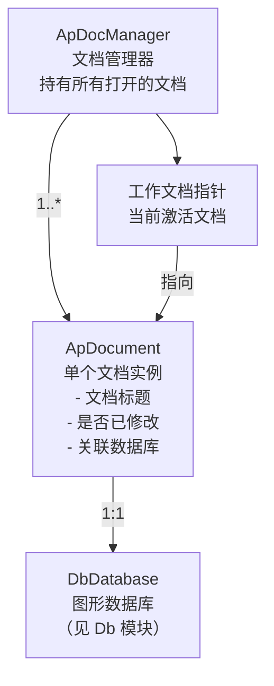

**关键接口**：
- `ApDocManager::newDoc()` — 创建新文档
- `ApDocManager::openDoc(path)` — 打开文件，触发 DXF 解析
- `ApDocManager::workDoc()` — 获取当前活动文档
- `ApDocument::database()` — 获取文档关联的图形数据库

---

### 3.7 Db（数据库层）

**路径**: `kernel/src/Db/`（134个文件） | `kernel/Include/public/Db/`

这是整个项目**最核心的模块**，实现了类似 AutoCAD 的图形数据库，负责所有 CAD 实体的存储、管理和序列化。

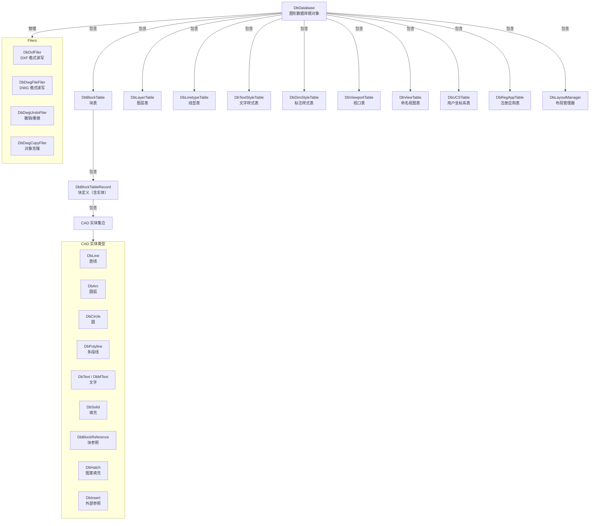

**对象 ID 系统**：

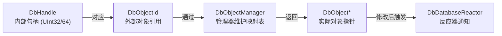

---

### 3.8 Gi（图形渲染）

**路径**: `kernel/src/Gi/`（43个文件） | `kernel/Include/public/Gi/`

负责将数据库中的 **CAD 实体转换为可渲染的几何数据**，是 Db 层到 Re 渲染层之间的桥梁。

```mermaid
graph TD
    DbEntity["DbEntity\n数据库实体"] --> |worldDraw()| GiWorldDraw["GiWorldDrawManager\n世界坐标系绘制接口"]
    GiWorldDraw --> |输出几何| GiGeometry["GiGeometry\n几何输出\n- polyline()\n- circle()\n- polygon()\n- mesh()"]
    GiGeometry --> |创建| GiEntity["GiEntity\n图形实体缓存\n(含顶点数据)"]
    GiEntity --> |注册到| GiEntityMgr["GiEntityManager\n图形实体管理器"]

    subgraph Materials["材质系统"]
        GiMaterial["GiMaterial\n材质基类"]
        GiLineMaterial["GiLineMaterial\n实线材质"]
        GiLineDashed["GiLineDashedMaterial\n虚线材质"]
        GiLinePxDashed["GiLinePixelDashedMaterial\n像素虚线"]
        GiPointMaterial["GiPointMaterial\n点材质"]
        GiMeshMaterial["GiMeshMaterial\n网格/填充材质"]
        GiMaterial --> GiLineMaterial
        GiMaterial --> GiLineDashed
        GiMaterial --> GiLinePxDashed
        GiMaterial --> GiPointMaterial
        GiMaterial --> GiMeshMaterial
    end

    GiEntity --> |使用| Materials
    GiEntityMgr --> |包围盒计算| GiExtents["GiExtentsCalculator\n范围计算器"]
```

---

### 3.9 Gs（图形元素）

**路径**: `kernel/src/Gs/` | `kernel/Include/public/Gs/`

管理屏幕上的**图形元素和光标**，处理坐标系显示。

| 类 | 功能 |
|----|------|
| `GsElementManager` | 管理所有可见图形元素 |
| `GsCursorManager` | 控制 CAD 十字光标的显示 |
| `GsCoordSystem` | 坐标系（UCS/WCS）显示管理 |

---

### 3.10 Re（渲染器管理）

**路径**: `kernel/src/Re/` | `kernel/Include/public/Re/`

管理**视口和摄像机**，协调从场景几何到最终输出的渲染流程。

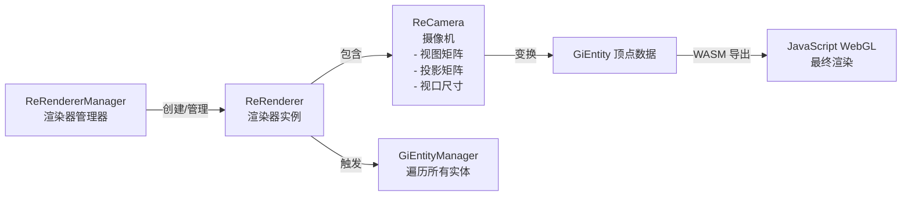

**摄像机操作**：
- 平移（Pan）：修改视图矩阵的位移分量
- 缩放（Zoom）：修改投影矩阵的缩放分量
- 旋转（Orbit）：通过 `GeQuaternion` 更新视图矩阵

---

### 3.11 Ed（编辑器/命令）

**路径**: `kernel/src/Ed/`（16个文件） | `kernel/Include/public/Ed/`

提供完整的 **CAD 命令系统和用户输入处理**，是 JavaScript 与 CAD 内核交互的主要入口。

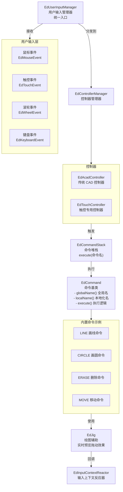

**Jig 机制**（实时预览）：
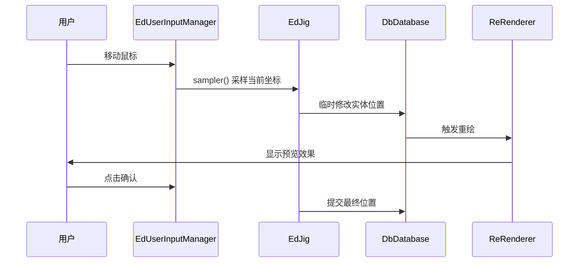

---

### 3.12 Pr（解析器）

**路径**: `kernel/src/Pr/` | `kernel/Include/public/Pr/`

负责解析 **DXF（Drawing Exchange Format）文件**，将文本数据转换为 DbDatabase 对象树。

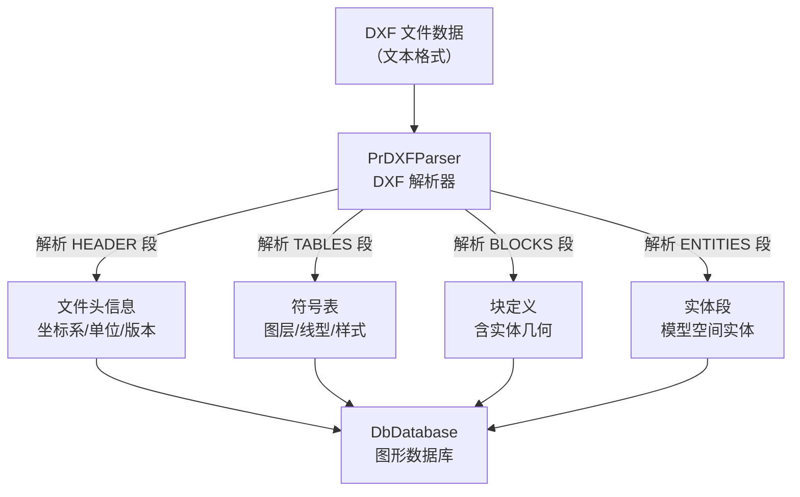

---

### 3.13 Emscripten（JS绑定层）

**路径**: `kernel/src/Emscripten/`（12个文件）

通过 Emscripten **Embind 机制**将 C++ 类导出为 JavaScript 可调用的接口。

| 绑定文件 | 导出内容 | 代码行数 |
|----------|----------|----------|
| `GeExport.cpp` | 所有几何类（点/向量/矩阵/曲线等） | 1440行 |
| `DbExport.cpp` | 数据库类（Database/Entity/Table等） | 617行 |
| `Acad.cpp` | 错误码、枚举、基础类型 | 572行 |
| `GiExport.cpp` | 图形渲染类（Entity/Material等） | 230行 |
| `EdExport.cpp` | 编辑器/命令/输入类 | ~200行 |
| `ApExport.cpp` | 文档管理类 | ~100行 |
| `ReExport.cpp` | 渲染器/摄像机类 | ~100行 |
| `kernel.cpp` | 全局函数（Manager 访问器） | ~50行 |

**JS 调用示例**：
```javascript
// 访问渲染器管理器
const rendererMgr = Module.acreRendererManager();

// 访问用户输入管理器  
const inputMgr = Module.acedUserInputManager();

// 访问主机应用服务（加载 DXF）
const hostApp = Module.acdbHostApplicationServices();
hostApp.emsdk_load_dxf_data(dxfTextData);
```

---

## 4. 核心数据流程

### 4.1 系统初始化流程

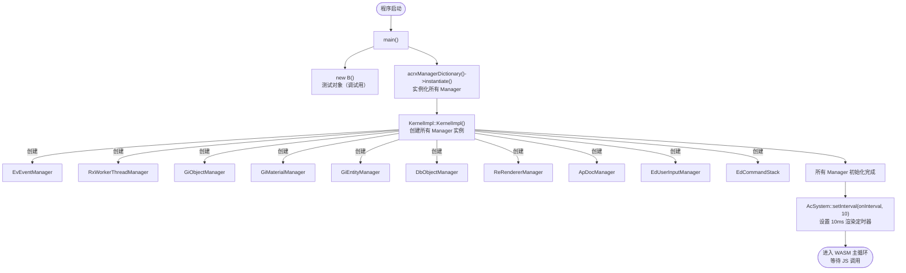

---

### 4.2 DXF文件加载流程

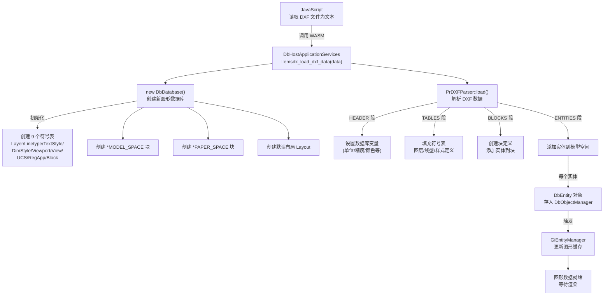

---

### 4.3 渲染流程

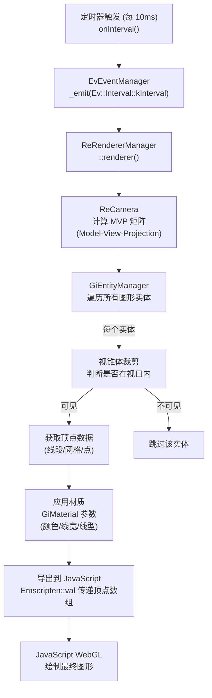

---

### 4.4 用户输入与命令执行流程

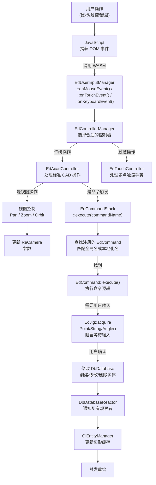

---

### 4.5 对象序列化流程

```mermaid
flowchart LR
    subgraph Save["保存流程"]
        DbObj2["DbObject\n图形对象"] --> |dwgOut()| DwgFiler["DbDwgFileFiler\nDWG 序列化器"]
        DbObj2 --> |dxfOut()| DxfFiler["DbDxfFiler\nDXF 序列化器"]
        DwgFiler --> DWGFile["output.dwg"]
        DxfFiler --> DXFFile["output.dxf"]
    end

    subgraph Load["加载流程"]
        DXFFile2["input.dxf"] --> PrParser["PrDXFParser\nDXF 解析器"]
        DWGFile2["input.dwg"] --> DwgReader["DbDwgFileFiler\nDWG 读取器"]
        PrParser --> |dwgIn()| DbObj["DbObject\n恢复的图形对象"]
        DwgReader --> |dwgIn()| DbObj
    end

    subgraph Undo["撤销/重做"]
        UndoFiler["DbDwgUndoFiler\n撤销序列化器"] --> |记录操作| UndoStack["撤销堆栈"]
        UndoStack --> |Ctrl+Z| RestoreObj["恢复对象状态"]
    end
```

---

## 5. 模块依赖关系

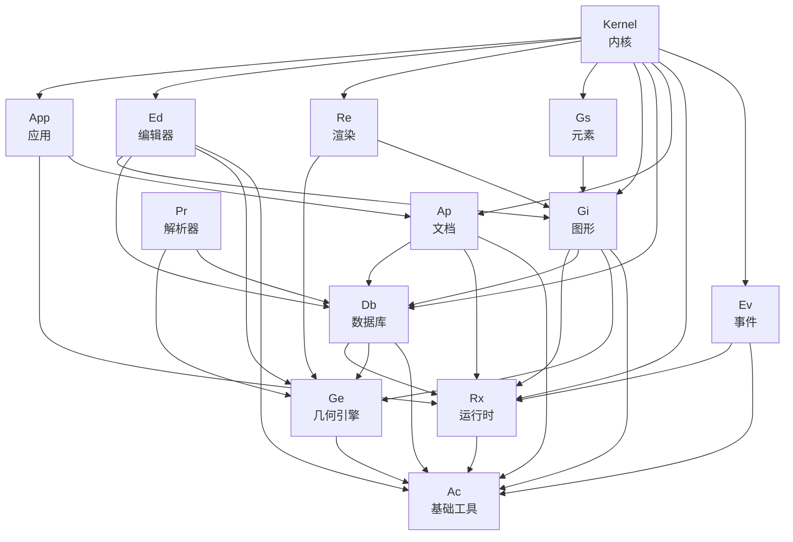

---

## 6. 技术栈

| 组件 | 技术 | 说明 |
|------|------|------|
| **核心语言** | C++11 | 现代 C++ 标准，支持移动语义、智能指针 |
| **构建系统** | CMake | 跨平台构建，支持 Windows/macOS/Linux/Web |
| **WASM 编译** | Emscripten | 将 C++ 编译为 WebAssembly |
| **JS 绑定** | Emscripten Embind | 导出 C++ 类和函数到 JavaScript |
| **序列化** | RapidJSON | 快速 JSON 解析，用于配置和数据传输 |
| **线程** | POSIX Threads + Emscripten | 支持 Web Worker 线程 |
| **异步** | Emscripten Asyncify | C++ 协程，支持 WASM 中的阻塞式输入 |
| **设计模式** | Pimpl (Pointer to Implementation) | 所有公共类隐藏实现细节，减小头文件依赖 |
| **对象模型** | 类 AutoCAD ObjectARX | Manager + Object ID + Reactor 架构 |

---

## 7. 构建系统

### 编译目标

```mermaid
graph LR
    Source["C++ 源码\n319 个 .cpp 文件"] --> CMake["CMake"]
    CMake --> |EMSCRIPTEN| WASM["webcad.wasm\n+ webcad.js\n(Web 平台)"]
    CMake --> |WIN32| DLL["webcad.dll/.lib\n(Windows)"]
    CMake --> |UNIX| SO["libwebcad.so\n(Linux)"]
    CMake --> |APPLE| Dylib["libwebcad.dylib\n(macOS)"]
```

### 主要 Emscripten 编译选项

| 选项 | 说明 |
|------|------|
| `-s WASM=1` | 输出 WebAssembly 格式 |
| `-s ASYNCIFY` | 启用异步支持（阻塞式 C++ 转协程） |
| `-s PROXY_TO_PTHREAD=1` | 主线程代理到 Worker 线程 |
| `-s ALLOW_MEMORY_GROWTH=1` | 允许内存动态增长 |
| `-s ALLOW_TABLE_GROWTH` | 允许函数表动态增长 |
| `--bind` | 启用 Embind JS 绑定 |

---

## 8. 目录结构

```
webcad/
└── kernel/                          # CAD 内核（全部源码）
    ├── main.cpp / main.h            # 程序入口
    ├── CMakeLists.txt               # CMake 构建配置（629行）
    ├── Include/
    │   ├── public/                  # 公开 API 头文件
    │   │   ├── Ac/                  # 基础工具头文件
    │   │   ├── Ap/                  # 文档管理头文件
    │   │   ├── Db/                  # 数据库头文件
    │   │   ├── Ed/                  # 编辑器头文件
    │   │   ├── Ge/                  # 几何引擎头文件
    │   │   ├── Gi/                  # 图形渲染头文件
    │   │   ├── Pr/                  # 解析器头文件
    │   │   ├── Rx/                  # 运行时头文件
    │   │   └── Emscripten/          # JS 绑定接口
    │   └── private/                 # 内部实现细节头文件（Pimpl）
    ├── src/
    │   ├── Ac/  (6个文件)           # 基础工具实现
    │   ├── Ge/  (67个文件)          # 几何引擎实现（最大）
    │   ├── Ev/  (4个文件)           # 事件系统实现
    │   ├── Rx/  (18个文件)          # 运行时系统实现
    │   ├── Ap/  (7个文件)           # 文档管理实现
    │   ├── Db/  (134个文件)         # 数据库实现（最核心）
    │   ├── Gi/  (43个文件)          # 图形渲染实现
    │   ├── Gs/  (4个文件)           # 图形元素实现
    │   ├── Ed/  (16个文件)          # 编辑器实现
    │   ├── App/ (2个文件)           # 应用管理实现
    │   ├── Re/  (5个文件)           # 渲染器实现
    │   ├── Pr/  (1个文件)           # DXF 解析实现
    │   ├── Ut/  (2个文件)           # 工具函数
    │   ├── Emscripten/ (12个文件)   # JS 绑定层
    │   └── kernel/ (1个文件)        # 内核单例实现
    ├── 3rdparty/
    │   └── rapidjson/               # JSON 解析库
    └── build/                       # 编译输出目录
        ├── wasm/                    # WebAssembly 输出
        └── win/                     # Windows 输出
```

---

*文档自动生成于 WebCAD 项目代码分析，基于 C++11 源码和 CMake 构建配置整理。*
